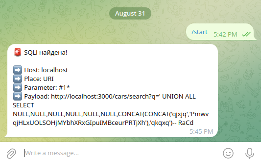
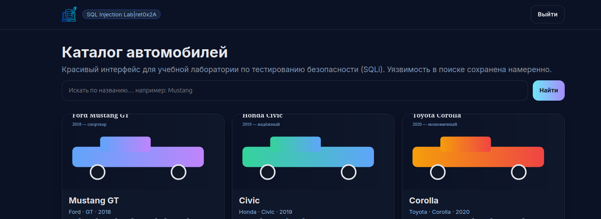
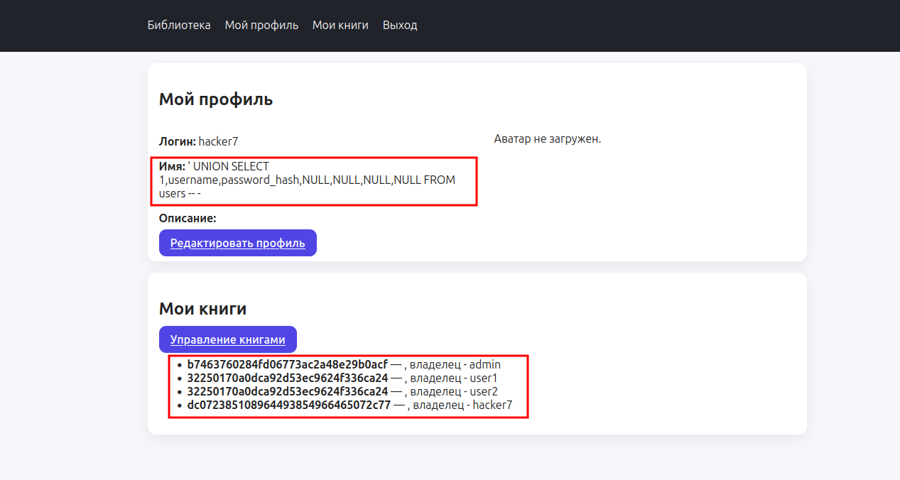

# Тамперы для SQLMAP

Репозиторий является дополнением к статье [«Больше чем тамперы. Прокачиваем sqlmap при помощи нетипичных скриптов»](https://xakep.ru/2025/09/18/sqlmap-advanced-tampers/) в журнале Хакер. 

В статье я рассмотрел несколько вариантов тамперов за рамками привычного. Вряд ли авторы SQLMAP думали, что кто-то залезет так далеко. Мои тамперы нужны не для того, чтобы протолкнуть пэйлоад через WAF. Вот, что ты найдешь в папке [tamper-examples](https://github.com/ret0x2A/sqlmap-tampers-guide/tree/main/tamper-examples):

## Предавторизация и получение токенов

[tamper-examples/refresh_token.py](https://github.com/ret0x2A/sqlmap-tampers-guide/blob/main/tamper-examples/refresh_token.py) — пример тампера с предварительной авторизацией и обновлением токена. Зачастую, работая с инъекцией, у тебя будет истекающий токен. Подобный тампер позволит спокойно выгружать данные. 

## Second-order SQL Injection

[tamper-examples/so_sqli.py](https://github.com/ret0x2A/sqlmap-tampers-guide/blob/main/tamper-examples/so_sqli.py) — пример тампера, который автоматизирует вторичную инъекцию.

**Важно!** Невозможно написать универсальный тампер под second-order. Каждое приложение уникально и каждый раз нужно писать отдельный тампер. Смысл в автоматизации процесса. Если у тебя нет UNION, руками устанешь выгружать базу. Твоя задача, взять пример и адаптировать 

Скрипт берет пейлоад и POST-запросом отправляет его в имя пользователя. Пейлоад уходит в неизменном виде, поэтому при запуске с несколькими тамперами, этот должен быть последним. Именно поэтому выбран самый низкий приоритет. Помни об этом, когда будешь писать под свой таргет.

## Оповещение о находках в Telegram

[tamper-examples/tg.py](https://github.com/ret0x2A/sqlmap-tampers-guide/blob/main/tamper-examples/tg.py) — тампер отправляет оповещение о найденных инъекциях в твой телеграм. Тебе нужно создать своего бота через @BotFather. добавить данные бота в окружение и наслаждаться автоматизацией. 

# Лабы

Чтобы опробовать тамперы, сделал несколько простых лабораторий. Каждая лаба, это отдельный Docker-конетйнер. 

## Веб-приложение Cars

[/labs/cars](https://github.com/ret0x2A/sqlmap-tampers-guide/tree/main/labs/cars) — тестовое приложение с базой данных автовладельцев. В приложении есть поиск по базе, который уязвим к SQL-инъекции, но имеет защиту. 

По легенде, искать может только пользователь с актуальным токеном. Веб-приложение использует два токена: `access_token` и `refresh_token`. Первый живет всего 15 секунд и обновляется при помощи второго. Рефреш живет 5 минут. Чтобы sqlmap мог работать, требуется каждые 15 секунд обновлять `access_token`.

## Приложение библиотека

[/labs/library](https://github.com/ret0x2A/sqlmap-tampers-guide/tree/main/labs/library) — приложение эмулирует работу Условный разработчик, допустил одну ошибку — недостаточная проверка имени в профиле пользователя. Чтобы атаковать приложение, вставь в имя пользователя `’ UNION SELECT 1,username,password_hash,NULL,NULL,NULL,NULL FROM users -- -`. Сохрани профиль и перейди на страницу «Мой профиль».

Для автоматической атаки через sqlmap, используй тампер [so_sqli.py](https://github.com/ret0x2A/sqlmap-tampers-guide/blob/main/tamper-examples/so_sqli.py "so_sqli.py"). 

# Другие ресурсы автора

🔥 Telegram: [Хакинг с ret0x2a](https://t.me/ret0x2A)

🎥 [Youtube-канал](https://www.youtube.com/@ret0x2A) автора

📝 Статьи в [журнале Хакер](https://xakep.ru/author/ret42/)
